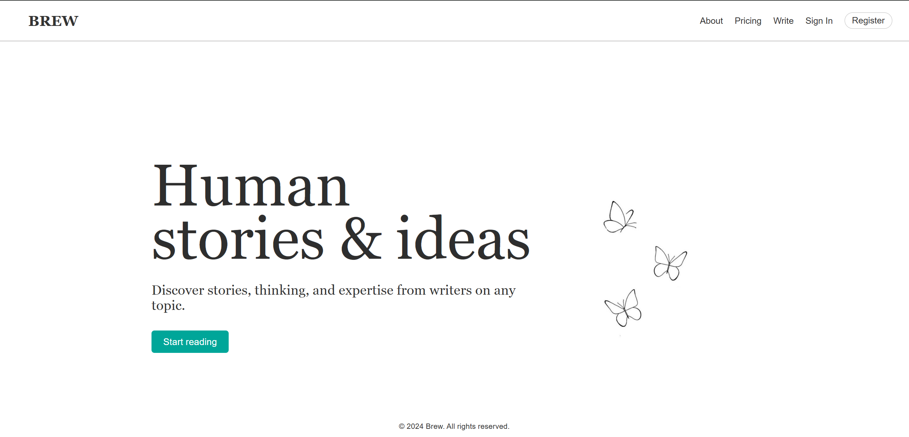

<h1>Website</h1>
Brew is built using React+Vite,ejs templates on an express server powering MongoDB.<br>
Basically, It comprises of a MERN stack web project.

<h2>About</h2>
<p>This is a mock project for the shortlisting of SDC club prospects. It is a clean, user-friendly blogging website's interface focusing on intuitive navigation. I have added cloud registering, therefore you can register and login from your system.</p>

P.S. I'm still working on making it responsive and rendering it remotely.<br><br>
Here's a preview to the home page :<br>

<h2>Tech Stack</h2>
Front-end
<ul>
  <li>React</li>
  <li>Vite</li>
  <li>CSS</li>
</ul>
Back-end
<ul>
  <li>Node.js</li>
  <li>Express.js</li>
  <li>.mjs server</li>
</ul>
Database
<ul>
  <li>MongoDB(Atlas+Compass)</li>
</ul>
Templating Engine
<ul>
  <li>EJS</li>
</ul>
<h2>Installation</h2>

```console
npm install
```

<h2>Local Development</h2>

```console
npm run dev


```
<h2>Host Server</h2>

```console
nodemon server.mjs
```
